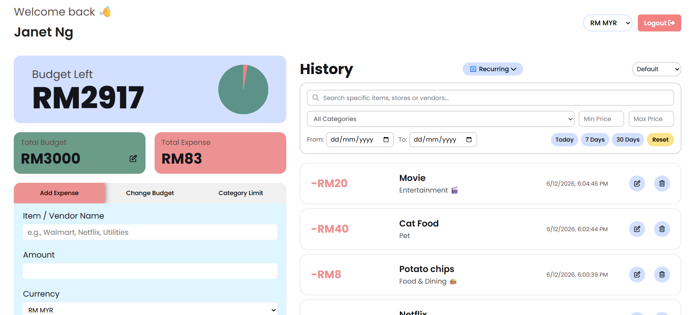
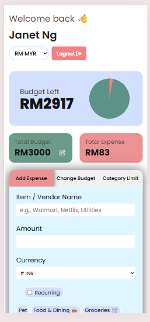

# Expense Tracker App 📊💰

> **CSE6364 Software Evolution & Maintenance** — Enhanced open-source expense tracker with cloud synchronization, multi-currency support, analytics, and Progressive Web App capabilities.

---

## Table of Contents

- [Overview](#overview)
- [Features](#features)
- [Enhancement Summary](#enhancement-summary)
- [Technologies Used](#technologies-used)
- [Installation](#installation)
- [Usage Guide](#usage-guide)
- [Testing](#testing)
- [Screenshots](#screenshots)
- [Project Structure](#project-structure)
- [Contributing](#contributing)
- [License](#license)
- [Acknowledgments](#acknowledgments)

---

## Overview

This project is an evolution of the original open-source [Expense Tracker App](https://github.com/avocadomilk6688/Expense-Tracker-App) by Manik Maity.

The original application stored data in browser `localStorage`, provided a single basic pie chart, and had no user accounts. Through a structured software maintenance and evolution process, the team has transformed it into a secure, cloud-synchronized, multi-currency, analytics-rich **Progressive Web App** with comprehensive testing and documentation.

---

## Features

### Original Features
- 💰 Budget input and editing
- 📊 Expense addition with custom tags
- 📜 Expense history display and sorting
- ✏️ Edit and delete expense entries
- 📈 Basic pie chart visualization

### Team Enhancements

| # | Feature | Description |
|---|---------|-------------|
| 1 | 🔐 **Firebase Authentication** | Secure email/password + Google OAuth login with cloud data isolation |
| 2 | 📋 **Category Budget Limits** | Per-category spending limits with real-time progress bars (turns red at 85%) |
| 3 | 🔍 **Search & Filter** | Keyword search, category filter, price range, and date range filtering |
| 4 | 💱 **Multi-Currency Support** | 11 currencies, live exchange rates via frankfurter.app, INR base conversion |
| 5 | 🔁 **Recurring Expenses** | Daily/weekly/monthly recurring templates with auto-trigger on app load |
| 6 | 📈 **Chart.js Data Visualization** | Category breakdown doughnut chart + 6-month spending trend line chart |
| 7 | 📱 **Progressive Web App (PWA)** | Installable, offline-capable app shell with service worker caching |

---

## Enhancement Summary

### Chart.js Data Visualization (Member C)

**Original limitation:** A single pie chart displayed only "Total Expense vs. Budget Remaining" — providing no insight into spending patterns.

**Enhancement:** A dedicated `chartEngine.js` module delivers:
- **Category Breakdown Doughnut Chart** — displays current month spending distributed by category, with color-coded segments, legend, and tooltips
- **Monthly Spending Trend Line Chart** — visualizes total spending over the last 6 months with a smooth curve, labeled axes, and currency-aware formatting
- **Dynamic updates** — both charts refresh automatically when transactions are added, edited, or deleted
- **Empty-state handling** — friendly messages display when no data exists
- **Responsive design** — stacks to single column on mobile screens
- **Accessibility** — ARIA labels on canvases and high-contrast color palette

### Progressive Web App (PWA) (Member C)

**Original limitation:** The app required a constant internet connection to load. Users could not install it or access any content offline.

**Enhancement:**
- **`manifest.json`** — enables browser install prompt with standalone window mode, custom icons, and app metadata
- **`sw.js`** — Service Worker implementing:
  - *Cache-First* strategy for the application shell (HTML, CSS, JS, icons)
  - *Network-First* strategy for external services (Firebase, FX API)
  - *Offline fallback* — the app UI loads from cache even without connectivity
  - *Versioned cache management* — stale caches are cleaned on SW activation

---

## Technologies Used

| Technology | Purpose |
|------------|---------|
| HTML5 / CSS3 / JavaScript (ES Modules) | Core application |
| Firebase Authentication | User login (email/password + Google OAuth) |
| Cloud Firestore | Cloud data persistence (transactions, tags, settings) |
| Chart.js | Data visualization (doughnut + line charts) |
| frankfurter.app API | Live foreign exchange rates |
| Service Worker API | PWA offline caching |
| Web App Manifest | PWA installability |
| Jest | Unit testing framework |
| Babel | ES module transpilation for Jest |
| Cypress | End-to-end integration testing |

---

## Installation

See [docs/INSTALLATION.md](docs/INSTALLATION.md) for the full setup guide.

**Quick start:**
```bash
# 1. Clone or download the repository
git clone https://github.com/your-repo/Expense-Tracker-App.git
cd Expense-Tracker-App

# 2. Install dev dependencies
npm install

# 3. Serve the app (requires a local HTTP server for ES modules + SW)
npx live-server --port=8080
# or: npx http-server -p 8080

# 4. Open http://127.0.0.1:8080 in Chrome
```

> **Important:** The app must be served over HTTP (not opened as a file) for Firebase, ES modules, and the Service Worker to function correctly.

---

## Usage Guide

See [docs/USER_GUIDE.md](docs/USER_GUIDE.md) for the complete user guide.

### Quick Reference

| Action | How |
|--------|-----|
| Sign in | Email/password or Google OAuth |
| Add expense | "Add Expense" tab → fill name, amount, currency, select tag → Add |
| Set budget | "Change Budget" tab → enter amount → Save |
| Set category limit | "Category Limit" tab → enter limit next to each tag |
| View analytics | Scroll down to "Spending Analytics" section |
| Install the app | Click install icon in browser address bar |

---

## Testing

See [docs/TESTING.md](docs/TESTING.md) for the full testing documentation.

```bash
# Run all unit tests
npm test

# Run unit tests with verbose output
npm test -- --verbose

# Run a specific test file
npm test -- --testPathPattern=chartEngine

# Run Cypress integration tests (requires app running on port 8080)
npx cypress run

# Open Cypress interactive mode
npx cypress open
```

### Test Coverage

| Area | Framework | Tests |
|------|-----------|-------|
| Chart data aggregation | Jest | 11 tests |
| Currency conversion | Jest | 3 tests |
| Filter engine | Jest | 5 tests |
| Category engine | Jest | 8 tests |
| Recurring engine | Jest | 2 tests |
| isDue logic | Jest | 2 tests |
| Auth & UI (E2E) | Cypress | 3 tests |
| Chart rendering (E2E) | Cypress | 7 tests |
| PWA validation (E2E) | Cypress | 8 tests |
| Currency (E2E) | Cypress | 1 test |
| Recurring (E2E) | Cypress | 1 test |
| Transactions (E2E) | Cypress | 1 test |

---

## Screenshots

| Desktop Dashboard | Mobile View |
|---|---|
|  |  |

> Additional screenshots (Charts, PWA install, offline mode) — see [docs/screenshots/](docs/screenshots/).

---

## Project Structure

```
Expense-Tracker-App/
├── index.html                  # Single-page application shell
├── style.css                   # Global styles + chart section styles
├── manifest.json               # PWA Web App Manifest
├── sw.js                       # Service Worker (cache strategies)
├── firebaseConfig.js           # Firebase project credentials
├── scripts/
│   ├── app.js                  # Main application controller
│   ├── authController.js       # Authentication UI logic
│   ├── firebaseStore.js        # Firebase data layer (Auth + Firestore)
│   ├── chartEngine.js          # Chart.js visualization module (NEW)
│   ├── categoryEngine.js       # Category budget limits
│   ├── currencyService.js      # Multi-currency conversion + FX rates
│   ├── filterEngine.js         # Transaction search & filter
│   ├── recurringEngine.js      # Recurring expense templates
│   └── localStorage.js         # Legacy localStorage module (unused)
├── tests/
│   ├── chartEngine.test.js     # Chart data aggregation unit tests (NEW)
│   ├── categoryEngine.test.js  # Category logic unit tests
│   ├── currencyService.test.js # Currency conversion unit tests
│   ├── filterEngine.test.js    # Filter logic unit tests
│   ├── isDue.test.js           # Recurring due-date logic tests
│   └── recurringEngine.test.js # Recurring CRUD unit tests
├── cypress/
│   └── e2e/
│       ├── auth.cy.js          # Auth + UI integration tests
│       ├── charts.cy.js        # Chart rendering integration tests (NEW)
│       ├── currency.cy.js      # Currency feature tests
│       ├── pwa.cy.js           # PWA validation tests (NEW)
│       ├── recurring.cy.js     # Recurring expense tests
│       └── transaction.cy.js   # Transaction flow tests
├── icons/                      # PWA icons (192x192, 512x512) (NEW)
├── docs/
│   ├── INSTALLATION.md
│   ├── USER_GUIDE.md
│   ├── TESTING.md
│   └── screenshots/
│       ├── PWA_SCREENSHOT_CHECKLIST.md
│       └── CHARTS_SCREENSHOT_CHECKLIST.md
├── Assets/                     # Preview images
├── Report/                     # Course assignment documents
├── package.json
└── babel.config.json
```

---

## Contributing

See [CONTRIBUTING.md](CONTRIBUTING.md) for guidelines.

---

## License

This project is licensed under the MIT License — see [LICENSE](LICENSE).

Original project by [Manik Maity](https://github.com/avocadomilk6688).

---

## Acknowledgments

- [Chart.js](https://www.chartjs.org/) — Data visualization library
- [Firebase](https://firebase.google.com/) — Authentication and Firestore
- [frankfurter.app](https://www.frankfurter.app/) — Free foreign exchange rates API
- [Font Awesome](https://fontawesome.com/) — Icons
- [Manik Maity](https://github.com/avocadomilk6688) — Original project author
